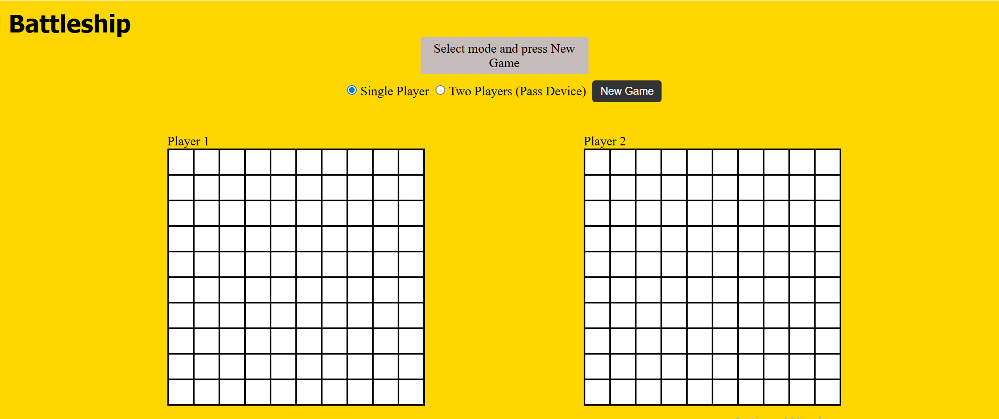

# Battleship Game (using JavaScript)

A small Battleship game implemented in vanilla JavaScript with modular classes and a simple UI.

This repository contains a playable Battleship game with two modes:
- Single Player (you vs simple computer AI)
- Two Player (Pass Device mode — players pass the device to each other to place ships and take turns)

The project includes unit tests (Jest) for core game logic components and a drag-and-drop UI for ship placement.


## Demo & Gameplay ✅

Open the `src/index.html` file in your browser (or serve the `src/` directory with a simple HTTP server) and press `New Game`.

Controls & how to play:
- Use the mode selection to choose Single Player (computer) or Two Player (pass device between players)
- Drag and drop ships to place them or click on a cell to place (fallback)
- Press the `R` key to rotate ship placement (Horizontal / Vertical)
- Click an opponent's board cell to attack
- In Pass Device mode: an overlay will appear instructing you to pass the device and reveal the board when ready (for two player mode)

Ships to place (default): 4, 3, 3, 2 (you may customize in `src/script.js`)


## Preview


[Watch the demo single Player](./Battleship-1.webm)

[Watch the demo 2 Players](./Battleship-2.webm)


---

## Features ✨
- Simple, modular game logic separated from UI (`src/modules.js`) — includes Ship, Gameboard, and Player classes
- Drag & drop ship placement with preview + invalid placement indicators
- Single Player mode vs a simple computer AI (random attack plus targeting adjacent tiles after a hit)
- Two Player pass-device mode with a reveal overlay for privacy
- Unit tests for core classes using Jest

---

## Getting Started 💡

Prerequisites:
- Node.js (recommended v16+ or later) and npm

Install dependencies (dev-only; you only need them for running tests and optional build tools):

```bash
npm install
```

Run tests:

```bash
npm test
```

---

## Testing ✅

This project uses Jest for unit tests found in `src/modules.test.js`.

To run tests:

```bash
npm test
```

Tests cover basic unit behavior for the core classes:
- Ship: ensures hit counting and sinking logic
- Gameboard: placement, collision & boundary checks, attacks, and allSunk()
- Player: exposes a Gameboard instance

---

## Project Structure 📁

```
.
├─ package.json
├─ README.md
└─ src/
	├─ index.html         # Main HTML file
	├─ style.css          # Game styles
	├─ script.js          # UI and glue code; attaches DOM & gameplay
	├─ modules.js         # Core classes (Ship, Gameboard, Player)
	└─ modules.test.js    # Jest unit tests for modules
```

---

## Design & Implementation Notes 🧠

- The project separates UI (DOM interactions/drag-drop) from the core game logic (Ship, Gameboard, Player classes). This makes unit-testing easier and keeps logic reusable.
- Board size is set to 10 (variable `boardSize` in `src/script.js`), and ships default to `[4, 3, 3, 2]`.
- Orientation is toggled via the `R` key; the UI also reflects the current orientation.
- Pass-device mode uses an overlay (`#pass-overlay`) to allow players to pass the device without seeing opponent ships.
- The computer AI chooses random attacks and queues adjacent cells after a hit to make it a bit smarter.

---

## Contributing 🤝

Contributions are welcome! If you want to add features or fix bugs:

---

## License 📜

This project is licensed under the MIT license
